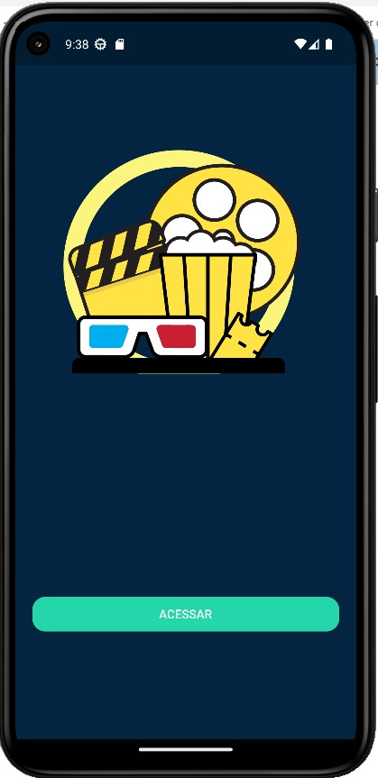
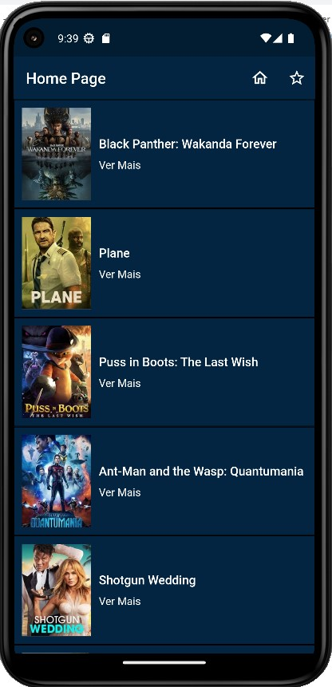
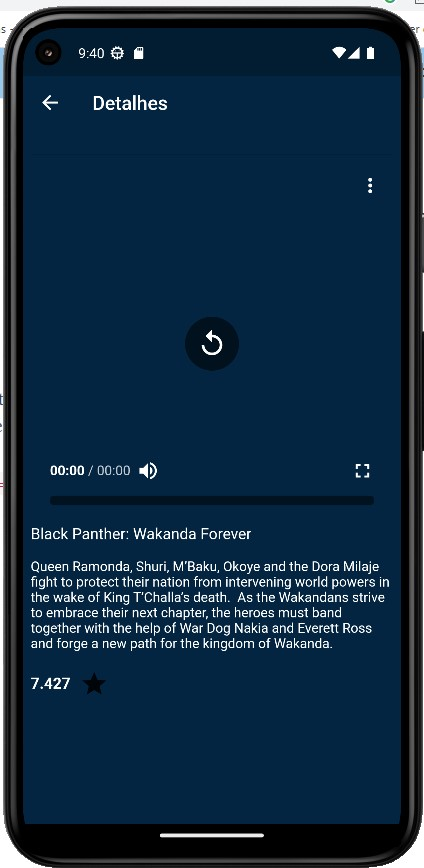
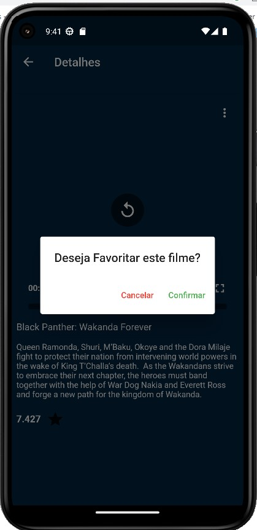
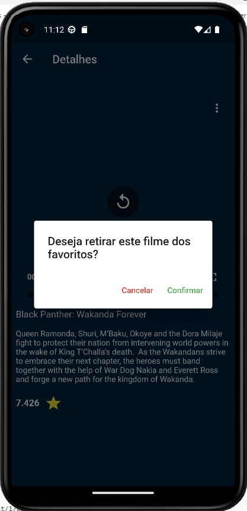
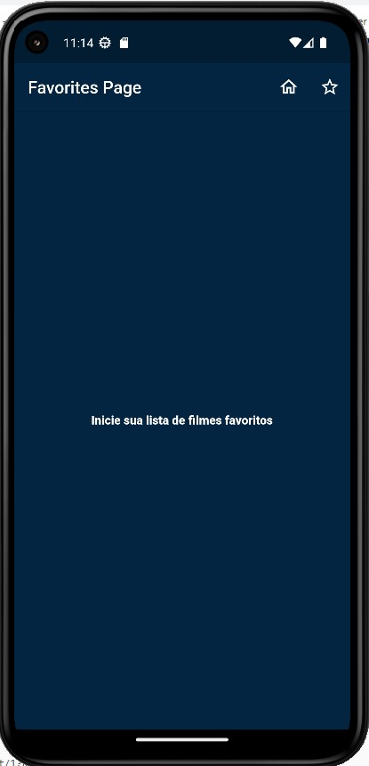
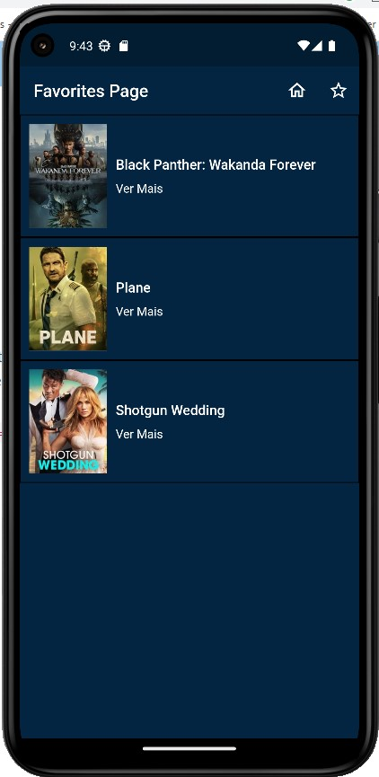

MovieApp
===================
O aplicativo MovieApp permite aos usuários acessarem uma lista de filmes fornecidos pela plataforma [themoviedb](https://www.themoviedb.org/). O objetivo é possibilitar ao usuário visualizar os filmes populares da plataforma, além de ver detalhes de cada filme e poder selecioná-los para uma lista separada de favoritos. 

# Especificações Técnicas
- **Dart:** 2.18.6
- **Flutter:** 3.3.10

## Pacotes
- **lottie:** ^2.2.0
- **dio:** ^5.0.0
- **video_player:** ^2.5.1
- **chewie:** ^1.4.0
- **provider:** ^6.0.5
- **shared_preferences:** ^2.0.17

# Funcionamento
## Requisitos
Para ter acesso à lista de filmes e outras informações é necessário ter um [requestToken](https://developers.themoviedb.org/4/getting-started/authorization) que é fornecido pelo próprio site, após criar uma conta e prosseguir até o modo api do site. Contudo, por ser de díficil manuseio do token para isnerção dentro do app, foi decidido manter um requestToken padrão dentro do próprio código.

## Passo a passo
Inicialmente o usuário acessa o aplicativo e visualiza a tela de splashpage, onde possui apenas a ação de clicar no botão de acessar.

Após clicar no botão de acessar o usuário pode visualizar a tela de home page, contendo filmes listados por poster e título. 

Ao clicar no texto "Ver mais" de algum filme é possível visualizar uma página particular de cada filme, onde inclui um vídeo trailer, o título, a descrição, a média de avaliação dos usuários e um ícone de estrela para favoritar o filme.

Ao clicar no ícone de estrela aparece uma tela de confirmação de ação sobre a possibilidade de favoritar ou desfavoritar o filme, dependendo se a ação já foi realizada ou não.

Caso a tela de favoritos seja acessada sem qualquer filme cadastrado a seguinte tela é exibida

Mas caso algum filme tenha sido inserido na lista de desejos, então uma tela semelhante é exibida

